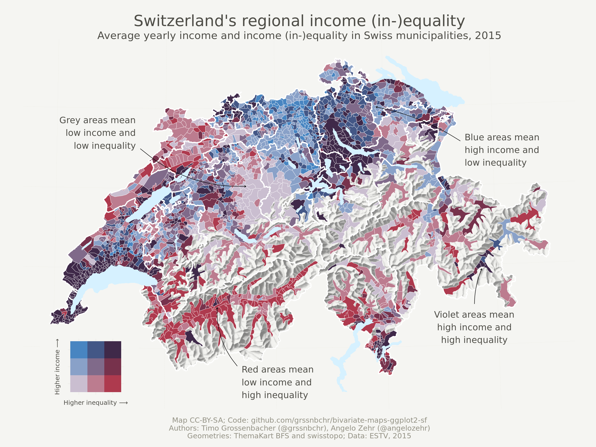

-   [Bivariate maps with ggplot2 and
    sf](#bivariate-maps-with-ggplot2-and-sf)
    -   [Outline](#outline)
    -   [Reproducibility](#reproducibility)
    -   [Preparations](#preparations)
    -   [Data Sources](#data-sources)
    -   [Define a Map Theme](#define-a-map-theme)
    -   [Create a Univariate
        Choropleth](#create-a-univariate-choropleth)
    -   [Create a Bivariate Choropleth](#create-a-bivariate-choropleth)
    -   [Linting](#linting)

Bivariate maps with ggplot2 and sf {#bivariate-maps-with-ggplot2-and-sf}
==================================

<!--  -->
The above map shows income (in-)equality in Switzerland on the
municipality level by visualizing two variables at the same time: [the
Gini coefficient](https://en.wikipedia.org/wiki/Gini_coefficient), and
average income (in Swiss Francs). It uses a so-called bivariate color
scale, blending two different color scales into one. Lastly, it uses the
beautiful relief depicting the mountainous Swiss landscape. Here we're
going to show you how to produce such a map *exclusively with R*.

For this blog post, I worked together with my colleague [Angelo
Zehr](https://twitter.com/angelozehr), who recently published a [nice
bivariate thematic
map](https://www.srf.ch/news/schweiz/interaktive-karte-so-ungleich-ist-das-einkommen-in-der-schweiz-verteilt)
comparing income equality and average income in Switzerland. We took
this opportunity to give a major update of my post on [thematic maps
with
ggplot2](https://timogrossenbacher.ch/2016/12/beautiful-thematic-maps-with-ggplot2-only/)
which is more than two years old, but still attracts hundreds of visits
each week. What has changed since then?

-   With the `sf` packacke and its integration into `ggplot2` through
    the `geom_sf()` function, it is now even easier to quickly create
    thematic maps.
-   In this post, we not only show how to produce a univariate map (with
    one variable displayed) but also a bivariate map, where two
    variables are displayed at the same time – using one visual variable
    (or aesthetic in `ggplot2` terms) only, namely the "fill" variable.
    As said above, this works by blending two color scales together.
-   This blog post also contains examples of a custom legend and
    annotations.

Outline {#outline}
-------

This tutorial is structured as follows:

-   Read in the thematic data and geodata (no preprocessing required)
    and join them.
-   Define a general map theme.
-   Create a univariate thematic map ("choropleth") showing the average
    income. This largely draws from [the late 2016 blog
    post](https://timogrossenbacher.ch/2016/12/beautiful-thematic-maps-with-ggplot2-only)
    and involves techniques for custom color classes and advanced
    aesthetics. *People who just want an update regarding `sf` and how
    it interacts with `ggplot2` can just read this section*.
-   Create a bivariate thematic map (also a "choropleth") showing
    average income and income (in-)equality at the same time. In this
    process, an unconvential legend is created and added to the plot,
    and annotations explaining different spatial patterns are added as
    well.

Let's go!

Reproducibility {#reproducibility}
---------------

As always, you can reproduce, reuse and remix everything you find here,
just go to [this
repository](https://github.com/grssnbchr/bivariate-maps-ggplot2-sf) and
clone it. All the needed input files are in the `input` folder, and the
main file to execute is `index.Rmd`. Right now, knitting it produces an
`index.md` that I use for my blog post on
[timogrossenbacher.ch](https://timogrossenbacher.ch), but you can adapt
the script to produce an HTML file, too. The PNGs produced herein are
saved to `wp-content/uploads/2019/04` so I can display them directly in
my blog, but of course you can also adjust this.

### GitHub {#github}

The code for the herein described process can also be freely downloaded
from <https://github.com/grssnbchr/bivariate-maps-ggplot2-sf>.

### License {#license}

**CC-BY-SA**

### Version information {#version-information}

This report was generated on 2019-04-19 08:57:28. R version: 3.5.2 on
x86\_64-pc-linux-gnu. For this report, CRAN packages as of 2019-03-01
were used.

Preparations {#preparations}
------------

### Clear workspace and install necessary packages {#clear-workspace-and-install-necessary-packages}

What follows from here until the section **Load Data** is just my usual
routine: Detach all packages, remove all variables in the global
environment, etc, and then load the packages from the MRAN server (a
snapshot from March 1st, 2019). With this, I ensure [reproducibility and
cross-device
compatibility](https://timogrossenbacher.ch/2017/07/a-truly-reproducible-r-workflow/).
I use my [freely available
template](https://github.com/grssnbchr/rddj-template) for this, with
some adaptions detailed under **Reproducibility**.

    ## [1] "package package:rmarkdown detached"

    ## Loading required package: knitr

    ## Loading required package: rstudioapi

### Define packages {#define-packages}

For this project, we just used the usual suspects, i.e. `tidyverse`
packages including `ggplot2` for plotting, `sf` for geodata processing
and `raster` for working with (spatial) raster data, i.e. the relief.
Also, the `viridis` package imports the beautiful Viridis color scale we
use for the univariate map.

``` r
# from https://mran.revolutionanalytics.com/web/packages/checkpoint/vignettes/using-checkpoint-with-knitr.html
# if you don't need a package, remove it from here (commenting is probably not sufficient)
cat("
library(rstudioapi)
library(tidyverse) # ggplot2, dplyr, tidyr, readr, purrr, tibble
library(magrittr) # pipes
library(lintr) # code linting
library(sf) # spatial data handling
library(raster) # raster handling (needed for relief)
library(viridis) # viridis color scale
library(cowplot) # stack ggplots
library(rmarkdown)",
file = "manifest.R")
```

### Install packages {#install-packages}

``` r
# if checkpoint is not yet installed, install it (for people using this
# system for the first time)
if (!require(checkpoint)) {
  if (!require(devtools)) {
    install.packages("devtools", repos = "http://cran.us.r-project.org")
    require(devtools)
  }
  devtools::install_github("RevolutionAnalytics/checkpoint",
                           ref = "v0.3.2", # could be adapted later,
                           # as of now (beginning of July 2017
                           # this is the current release on CRAN)
                           repos = "http://cran.us.r-project.org")
  require(checkpoint)
}
# nolint start
if (!dir.exists("~/.checkpoint")) {
  dir.create("~/.checkpoint")
}
# nolint end
# install packages for the specified CRAN snapshot date
checkpoint(snapshotDate = package_date,
           project = path_to_wd,
           verbose = T,
           scanForPackages = T,
           use.knitr = F,
           R.version = R_version)
rm(package_date)
```

### Load packages {#load-packages}

Here the packages are actually loaded. From the `sessionInfo()` output
you can see the exact version numbers of packages used herein.

``` r
source("manifest.R")
unlink("manifest.R")
sessionInfo()
```

    ## R version 3.5.2 (2018-12-20)
    ## Platform: x86_64-pc-linux-gnu (64-bit)
    ## Running under: Ubuntu 18.04.1 LTS
    ## 
    ## Matrix products: default
    ## BLAS: /usr/lib/x86_64-linux-gnu/openblas/libblas.so.3
    ## LAPACK: /usr/lib/x86_64-linux-gnu/libopenblasp-r0.2.20.so
    ## 
    ## locale:
    ##  [1] LC_CTYPE=en_US.UTF-8       LC_NUMERIC=C              
    ##  [3] LC_TIME=de_CH.UTF-8        LC_COLLATE=en_US.UTF-8    
    ##  [5] LC_MONETARY=de_CH.UTF-8    LC_MESSAGES=en_US.UTF-8   
    ##  [7] LC_PAPER=de_CH.UTF-8       LC_NAME=C                 
    ##  [9] LC_ADDRESS=C               LC_TELEPHONE=C            
    ## [11] LC_MEASUREMENT=de_CH.UTF-8 LC_IDENTIFICATION=C       
    ## 
    ## attached base packages:
    ## [1] stats     graphics  grDevices utils     datasets  methods   base     
    ## 
    ## other attached packages:
    ##  [1] rmarkdown_1.11    cowplot_0.9.4     viridis_0.5.1    
    ##  [4] viridisLite_0.3.0 raster_2.8-19     sp_1.3-1         
    ##  [7] sf_0.7-3          lintr_1.0.3       magrittr_1.5     
    ## [10] forcats_0.4.0     stringr_1.4.0     dplyr_0.8.0.1    
    ## [13] purrr_0.3.0       readr_1.3.1       tidyr_0.8.2      
    ## [16] tibble_2.0.1      ggplot2_3.1.0     tidyverse_1.2.1  
    ## [19] checkpoint_0.4.0  rstudioapi_0.9.0  knitr_1.21       
    ## 
    ## loaded via a namespace (and not attached):
    ##  [1] tidyselect_0.2.5 xfun_0.5         haven_2.1.0      lattice_0.20-38 
    ##  [5] colorspace_1.4-0 generics_0.0.2   htmltools_0.3.6  yaml_2.2.0      
    ##  [9] rlang_0.3.1      e1071_1.7-0.1    pillar_1.3.1     glue_1.3.0      
    ## [13] withr_2.1.2      DBI_1.0.0        modelr_0.1.4     readxl_1.3.0    
    ## [17] plyr_1.8.4       munsell_0.5.0    gtable_0.2.0     cellranger_1.1.0
    ## [21] rvest_0.3.2      codetools_0.2-16 evaluate_0.13    rex_1.1.2       
    ## [25] class_7.3-15     broom_0.5.1      Rcpp_1.0.0       scales_1.0.0    
    ## [29] backports_1.1.3  classInt_0.3-1   jsonlite_1.6     gridExtra_2.3   
    ## [33] hms_0.4.2        digest_0.6.18    stringi_1.3.1    grid_3.5.2      
    ## [37] cli_1.0.1        tools_3.5.2      lazyeval_0.2.1   crayon_1.3.4    
    ## [41] pkgconfig_2.0.2  xml2_1.2.0       lubridate_1.7.4  assertthat_0.2.0
    ## [45] httr_1.4.0       R6_2.4.0         units_0.6-2      nlme_3.1-137    
    ## [49] compiler_3.5.2

Data Sources {#data-sources}
------------

### Thematic Data {#thematic-data}

Here the thematic data to be visualized is loaded. It is contained in a
CSV consisting of columns:

-   "municipality (name)",
-   "bfs\_id" (ID to match with geodata),
-   "mean" (average income in the municipality)
-   "gini" (the Gini index for income (in-)equality)

The data provider in this case is the Swiss Federal Tax Administration,
where the original data (as an Excel) can be [downloaded
from](https://www.estv.admin.ch/dam/estv/de/dokumente/allgemein/Dokumentation/Zahlen_fakten/Steuerstatistiken/direkte_bundessteuer/np_statistische_kennzahlen_ohne/NP_2015_mitnull.xlsx.download.xlsx/NP_2015_mitnull.xlsx).
The columns used were "mean\_reinka" and "gini\_reinka" for "mean" and
"gini" (in the "Gemeinden - Communes" tab), respectively. See the first
tabs in the Excel for a short explanation. Find additional explanations
on [the SFTA website
(German)](https://www.estv.admin.ch/estv/de/home/allgemein/steuerstatistiken/fachinformationen/steuerstatistiken/direkte-bundessteuer.html),
especially in [this
PDF](https://www.estv.admin.ch/dam/estv/de/dokumente/allgemein/Dokumentation/Zahlen_fakten/Steuerstatistiken/direkte_bundessteuer/np_statistische_kennzahlen_ohne/Einleitung.pdf.download.pdf/1-Einleitung_NP_d.pdf).

We used the year 2015 as it is the youngest in the available time
series.

``` r
data <- read_csv("input/data.csv")
```

### Geodata {#geodata}

Various geodata from the Swiss Federal Statistical Office and the Swiss
Federal Office of Topography (swisstopo) depicting Swiss borders as of
2015 are used herein.

-   `input/gde-1-1-15.*`: These geometries do not show the political
    borders of Swiss municipalities, but the so-called "productive"
    area, i.e., larger lakes and other "unproductive" areas such as
    mountains are excluded. This has two advantages: 1) The relatively
    sparsely populated but very large municipalities in the Alps don't
    have too much visual weight and 2) it allows us to use the beautiful
    raster relief of the Alps as a background. The data are also from
    the FSO, but not freely available. I was allowed to republish the
    Shapefile for this educational purpose (also included in the `input`
    folder). Please stick to that policy.
-   `input/g2*`: National (`s`) as well as cantonal borders (`k`) and
    lakes (`l`). Available
    [here](https://www.bfs.admin.ch/bfs/de/home/dienstleistungen/geostat/geodaten-bundesstatistik/administrative-grenzen/generalisierte-gemeindegrenzen.html).
-   (Hillshaded) relief: This is a freely available GeoTIFF from [the
    Swiss Federal Office of Topography
    (swisstopo)](https://shop.swisstopo.admin.ch/en/products/maps/national/digital/srm1000).
    For the sake of simplicity, it was converted to the "ESRI ASCII"
    format using
    `gdal_translate -of AAIGrid 02-relief-georef.tif 02-relief-ascii.asc`
    on the CLI. The `raster` can read that format natively, without the
    need of explicitly installing the `rgdal` package – which is not the
    case for GeoTIFF files.

``` r
# read cantonal borders
canton_geo <- read_sf("input/g2k15.shp")

# read country borders
country_geo <- read_sf("input/g2l15.shp")

# read lakes
lake_geo <- read_sf("input/g2s15.shp")

# read productive area (2324 municipalities)
municipality_prod_geo <- read_sf("input/gde-1-1-15.shp")

# read in raster of relief
relief <- raster("input/02-relief-ascii.asc") %>%
  # hide relief outside of Switzerland by masking with country borders
  mask(country_geo) %>%
  as("SpatialPixelsDataFrame") %>%
  as.data.frame() %>%
  rename(value = layer)

# clean up
rm(country_geo)
```

### Join Geodata with Thematic Data {#join-geodata-with-thematic-data}

In the following chunk, the municipality geodata is extended (joined)
with the thematic data over each municipality's unique identifier, so we
end up with a data frame consisting of the income data as well as the
geometries. Note that the class of this resulting object is still `sf`
as well as `data.frame`.

``` r
municipality_prod_geo %<>%
  left_join(data, by = c("BFS_ID" = "bfs_id"))
class(municipality_prod_geo)
```

    ## [1] "sf"         "tbl_df"     "tbl"        "data.frame"

Define a Map Theme {#define-a-map-theme}
------------------

We first define a unique theme for the map, e.g. remove all axes, add a
subtle grid (that you might not be able to see on a bright screen) etc.
We mostly took this from [another of Timo's blog
posts](https://timogrossenbacher.ch/2018/03/categorical-spatial-interpolation-with-r/).

``` r
theme_map <- function(...) {
  theme_minimal() +
  theme(
    text = element_text(family = "Ubuntu Regular", color = "#22211d"),
    # remove all axes
    axis.line = element_blank(),
    axis.text.x = element_blank(),
    axis.text.y = element_blank(),
    axis.ticks = element_blank(),
    # add a subtle grid
    panel.grid.major = element_line(color = "#ebebe5", size = 0.2),
    panel.grid.minor = element_blank(),
    # background colors
    plot.background = element_rect(fill = "#f5f5f2", color = NA), 
    panel.background = element_rect(fill = "#f5f5f2", color = NA), 
    legend.background = element_rect(fill = "#f5f5f2", color = NA),
    # borders and margins
    plot.margin = unit(c(.5, .5, .2, .5), "cm"),
    panel.border = element_blank(),
    panel.spacing = unit(c(-.1, 0.2, .2, 0.2), "cm"),
    # titles
    legend.title = element_text(size = 13),
    legend.text = element_text(size = 11, hjust = 0, color = "#4e4d47"),
    plot.title = element_text(size = 16, hjust = 0.5, color = "#4e4d47"),
    plot.subtitle = element_text(size = 12, hjust = 0.5, color = "#4e4d47", 
                                 margin = margin(b = -0.1, 
                                                 t = -0.1, 
                                                 l = 2, 
                                                 unit = "cm"), 
                                 debug = F),
    # captions
    plot.caption = element_text(size = 9, 
                                # hjust = .5, 
                                margin = margin(t = 0.2, 
                                                b = 0, 
                                                unit = "cm"), 
                                color = "#939184"),
    ...
  )
}
```

Create a Univariate Choropleth {#create-a-univariate-choropleth}
------------------------------

First, let's create a standard (univariate) choropleth map based on the
average income alone ("mean" variable).

Without going into much detail, this is basically the same process as in
the old blog post, detailed in the [respective
section](https://timogrossenbacher.ch/2016/12/beautiful-thematic-maps-with-ggplot2-only/#discrete-classes-with-quantile-scale),
just using `sf` instead of `sp`.

1.  We first calculate quantiles from the average income to form 6
    different classes of average income (quantiles are used so each
    color class contains approximately the same amount of
    municipalities). From this, we generate a new variable
    "mean\_quantiles" which is actually visualized on the map. We also
    generate custom labels for the classes.

2.  We generate the `ggplot2` object as follows:

-   Specify the data source and the main fill aesthetic (the visual
    variable showing the average income per municipality).
-   Add the Viridis color scale with the correct number of classes.
-   Add the relief through a call to `geom_raster()`.
-   Add a truncated alpha scale for the relief, as the "fill" aesthetic
    is already taken (refer to [this
    section](https://timogrossenbacher.ch/2016/12/beautiful-thematic-maps-with-ggplot2-only/#relief)
    for an explanation).
-   Use `geom_sf()` without an additional data argument to visualize
    municipal borders.
-   Use two more `geom_sf()` calls to add cantonal borders and lakes
    stemming from the `canton_geo` and `lake_geo` datasets,
    respectively.
-   Specify our previously defined map theme.
-   Add titles and subtitles.

``` r
# define number of classes
no_classes <- 6
labels <- c()

# extract quantiles
quantiles <- municipality_prod_geo %>% 
  pull(mean) %>%
  quantile(probs = seq(0, 1, length.out = no_classes + 1))

# here we define custom labels (the default ones would be ugly)
labels <- c()
for(idx in 1:length(quantiles)){
  labels <- c(labels, paste0(round(quantiles[idx] / 1000, 0), 
                             "k",
                             " – ", 
                             round(quantiles[idx + 1] / 1000, 0),
                             "k CHF"))
}

# we need to remove the last label 
# because that would be something like "478k - NA"
labels <- labels[1:length(labels) - 1]

# here we actually create a new 
# variable on the dataset with the quantiles
municipality_prod_geo %<>% 
  mutate(mean_quantiles = cut(mean, 
                               breaks = quantiles, 
                               labels = labels, 
                               include.lowest = T))

ggplot(
  # define data and aesthetic mapping, which is just the fill
  data = municipality_prod_geo
) +
  # use the Viridis color scale
  # the discrete-option is used, 
  # and we use guide_legend instead of guide_colourbar
  scale_fill_viridis(
    option = "magma",
    name = "Average income",
    alpha = 0.8, # make fill a bit brighter
    begin = 0.1, # this option seems to be new (compared to 2016): 
    # with this we can truncate the 
    # color scale, so tht extreme colors (very dark and very bright) are not
    # used, which makes the map a bit more beautiful
    end = 0.9,
    discrete = T,
    direction = 1, # dark is lowest, yellow is highest
    guide = guide_legend(
     keyheight = unit(5, units = "mm"),
     title.position = 'top',
     reverse = T # display highest income on top
  )) +
  # first: draw the relief
  # geom_raster(
  #   data = relief,
  #   inherit.aes = FALSE,
  #   aes(
  #     x = x,
  #     y = y,
  #     alpha = value
  #   )
  # ) +
  # use the "alpha hack" (as the "fill" aesthetic is already taken)
  scale_alpha(name = "", range = c(0.6, 0), guide = F)  +
  # use thin white stroke for municipality borders
  geom_sf(
    mapping = aes(fill = mean_quantiles),
    color = "white",
    size = 0.1
  ) +
  # use thicker white stroke for cantonal borders
  geom_sf(
    data = canton_geo,
    fill = "transparent",
    color = "white",
    size = 0.5
  ) +
  # draw lakes in light blue
  geom_sf(
    data = lake_geo,
    fill = "#D6F1FF",
    color = "transparent"
  ) +
  # add theme
  theme_map() +
  # add titles
  labs(x = NULL, 
         y = NULL, 
         title = "Switzerland's regional income", 
         subtitle = "Average income in Swiss municipalities, 2015", 
         caption = paste0("Map CC-BY-SA\nAuthors: Timo Grossenbacher",
                          " (@grssnbchr), Angelo Zehr (@angelozehr)",
                          "\nGeometries: ThemaKart BFS and swisstopo;",
                          " Data: ESTV, 2015"))
```


Create a Bivariate Choropleth {#create-a-bivariate-choropleth}
-----------------------------

In this last section, we finally create the bivariate map. For this, we
first specify a bivariate color scale, using an external tool to
calculate the appropriate color values. Then we draw the map with
basically the same logic as for the univariate map. We then add custom
annotations to the map. Lastly, we come up with a possible design of a
legend and add that to the overall plot in the end.

### Create the Bivariate Color Scale {#create-the-bivariate-color-scale}

[Joshua
Stevens](http://www.joshuastevens.net/cartography/make-a-bivariate-choropleth-map/)
describes very well how to create the color codes for a sequential
bivariate color scheme. He also gives some background on readability and
accessibility of such maps and thus we refrain from discussing these
points here. Our blog post is intended to remain purely technical, also
for the sake of space and reading time.

Using the Sketch software we combined three rectangles with fill blue
(base color \#1E8CE3) and red (base color \#C91024) each with three
different opacities (20%, 50%, 80%) and blend mode "multiply", which
resulted in the 3 \* 3 = 9 hex values specified manually below. Side
note: If somebody comes up with a handy way of "blending" hex values in
R, or even knows a package for that, please notify us in the comments. A
bit more of automation would be nice.

By the way, this GIF from Joshua's blog shows the process of blending
the two scales in an awesome fashion:


``` r
# create 3 buckets for gini
quantiles_gini <- data %>% 
  pull(gini) %>% 
  quantile(probs = seq(0, 1, length.out = 4))

# output for inspection
quantiles_gini
```

    ##        0% 33.33333% 66.66667%      100% 
    ##     0.264     0.398     0.436     0.936

``` r
# create 3 buckets for mean income
quantiles_mean <- data %>% 
  pull(mean) %>% 
  quantile(probs = seq(0, 1, length.out = 4))

# output for inspection
quantiles_mean
```

    ##        0% 33.33333% 66.66667%      100% 
    ##  16603.00  35353.33  41187.33 478065.00

``` r
# pretty breaks
# based on the values above, we manually define the breaks in a more human
# readable way by rounding
pretty_breaks_gini <- c(0, 0.4, 0.45, 1)
pretty_breaks_mean <- c(0, 35000, 40000, 1000000)

# create color scale that encodes two variables
# red for gini and blue for mean income
# the special notation with gather is due to readibility reasons
bivariate_color_scale <- tibble(
  "3 - 3" = "#3F2949", # high inequality, high income
  "2 - 3" = "#435786",
  "1 - 3" = "#4885C1", # low inequality, high income
  "3 - 2" = "#77324C",
  "2 - 2" = "#806A8A", # medium inequality, medium income
  "1 - 2" = "#89A1C8",
  "3 - 1" = "#AE3A4E", # high inequality, low income
  "2 - 1" = "#BC7C8F",
  "1 - 1" = "#CABED0" # low inequality, low income
) %>%
  gather("group", "fill")
```

### Join Color Codes to the Data {#join-color-codes-to-the-data}

Here the municipalities are put into the appropriate class corresponding
to their average income and income inequality.

``` r
# cut into groups defined above and join fill
municipality_prod_geo %<>%
  mutate(
    gini_quantiles = cut(
      gini,
      # you could also use the quantiles with unrounded values: quantiles_gini
      breaks = pretty_breaks_gini,
      include.lowest = TRUE
    ),
    mean_quantiles = cut(
      mean,
      # you could also use the quantiles with unrounded values: quantiles_mean
      breaks = pretty_breaks_mean,
      include.lowest = TRUE
    ),
    # by pasting the factors together as numbers we match the groups defined
    # in the tibble bivariate_color_scale
    group = paste(
      as.numeric(gini_quantiles), "-",
      as.numeric(mean_quantiles)
    )
  ) %>%
  # we now join the actual hex values per "group"
  # so each municipality knows its hex value based on the his gini and avg 
  # income value
  left_join(bivariate_color_scale, by = "group")
```

### Draw the Map {#draw-the-map}

As said above, this is basically the same approach as in the univariate
case What's special here is the

We found out that with this version of `ggplot2`, if you provide x- and
y- coordinates directly in the `aes()` function of `geom_text()` and
`geom_curve()`, you will get problems with anti-aliasing. For this
reason we need to save all annotations that we want to make into a
separate data frame that can be used as a data source for the respective
geometries.

To find out from where to where an annotation arrow should be drawn, we
went to the awesome [Swiss national map](https://map.geo.admin.ch) and
manually extracted the x- and y- coordinates of the start and the end
point of the arrow.

``` r
annotations <- tibble(
  label = c(
    "Grey areas mean\nlow income and\nlow inequality",
    "Blue areas mean\nhigh income and\nlow inequality",
    "Violet areas mean\nhigh income and\nhigh inequality",
    "Red areas mean\nlow income and\nhigh inequality"
  ),
  arrow_from = c(
    "548921,232972", # grey
    "771356,238335", # blue
    "781136,125067", # violet
    "616348,81869" # red
  ),
  arrow_to = c(
    "622435,206784", # grey
    "712671,261998", # blue
    "786229,149597", # violet
    "602334,122674" # red
  ),
  curvature = c(
    0.2, # grey
    0.1, # blue
    -0.1, # violet
    -0.2 # red
  ),
  nudge = c(
    "-3000,0", # grey
    "3000,5000", # blue
    "0,-5000", # violet
    "3000,0" # red
  ),
  just = c(
    "1,0", # grey
    "0,1", # blue
    "0.5,1", # violet
    "0,1" # red
  )
) %>%
  separate(arrow_from, into = c("x", "y")) %>%
  separate(arrow_to, into = c("xend", "yend")) %>%
  separate(nudge, into = c("nudge_x", "nudge_y"), sep = "\\,") %>%
  separate(just, into = c("hjust", "vjust"), sep = "\\,")
```

``` r
map <- ggplot(
  # use the same dataset as before
  data = municipality_prod_geo
  ) +
  # first: draw the relief
  geom_raster(
    data = relief,
    aes(
      x = x,
      y = y,
      alpha = value
    )
  ) +
  # use the "alpha hack"
  scale_alpha(name = "", range = c(0.6, 0), guide = F) +
  geom_sf(
    aes(
      fill = fill
    ),
    # use thin white stroke for municipalities
    color = "white",
    size = 0.1
  ) +
  # as the sf object municipality_prod_geo has a column with name "fill" that
  # contains the literal color as hex code for each municipality, we can use
  # scale_fill_identity here
  scale_fill_identity() +
  # use thicker white stroke for cantons
  geom_sf(
    data = canton_geo,
    fill = "transparent",
    color = "white",
    size = 0.5
  ) +
  # draw lakes in light blue
  geom_sf(
    data = lake_geo,
    fill = "#D6F1FF",
    color = "transparent"
  ) +
  # add titles
  labs(x = NULL, 
         y = NULL, 
         title = "Switzerland's regional income inequality", 
         subtitle = paste0("Average income and income",
                           " inequality in Swiss municipalities, 2015"),
         caption = paste0("Map CC-BY-SA\nAuthors: Timo Grossenbacher",
                          " (@grssnbchr), Angelo Zehr (@angelozehr)",
                          "\nGeometries: ThemaKart BFS and swisstopo;",
                          " Data: ESTV, 2015")) +
  # add the theme
  theme_map()

# add annotations one by one by walking over the annotations data frame
# this is necessary because we cannot define nudge_x, nudge_y and curvature
# in the aes in a data-driven way like as with x and y, for example
annotations %>%
  pwalk(function(...) {
    # collect all values in the row in a one-rowed data frame
    current <- tibble(...)

    # convert all columns from x to vjust to numeric
    # as pwalk apparently turns everything into a character (why???)
    current %<>%
      mutate_at(vars(x:vjust), as.numeric)

    # update the plot object with global assignment
    map <<- map +
      # for each annotation, add an arrow
      geom_curve(
        data = current,
        aes(
          x = x,
          xend = xend,
          y = y,
          yend = yend
        ),
        curvature = current$curvature,
        size = 0.2,
        arrow = arrow(
          length = unit(0.005, "npc")
        )
      ) +
      # for each annotation, add a label
      geom_text(
        data = current,
        aes(
          x = x,
          y = y,
          label = label,
          hjust = hjust,
          vjust = vjust
        ),
        nudge_x = current$nudge_x,
        nudge_y = current$nudge_y,
        size = 3
      )
  })
```

### Draw the Legend {#draw-the-legend}

For the legend we use the `geom_tile()` geometry of `ggplot2`. Before
that, we have to quickly transform the `bivariate_color_scale` data
frame, which contains all the hex values for all combinations of average
income and income inequality classes, so it has an x- and y-column.

``` r
# separate the groups
bivariate_color_scale %<>%
  separate(group, into = c("gini", "mean"), sep = " - ") %>% 
  mutate(gini = as.integer(gini),
         mean = as.integer(mean))

legend <- ggplot() +
  geom_tile(
    data = bivariate_color_scale,
    mapping = aes(
      x = gini,
      y = mean,
      fill = fill)
  ) +
  scale_fill_identity() +
  labs(x = "Higher inequality ⟶️",
       y = "Higher income ⟶️") +
  theme_map() +
  # make font small enough
  theme(
    axis.title = element_text(size = 4),
  ) +
  # quadratic tiles
  coord_fixed()
```

### Combine Map and Legend {#combine-map-and-legend}

Here we just combine the legend with the map using the `cowplot`
package. It allows us to specify the exact position of plots on the
canvas, and scaling the width and height of plots (as we do with the
legend). It would have been nice to rotate the legend by 45° but we
didn't find a way how to do this.

The numeric arguments to `draw_plot()` are basically trial and error.

``` r
ggdraw() +
  draw_plot(map, 0, 0, 1, 1) +
  draw_plot(legend, 0.15, 0.05, 0.2, 0.2)
```



Linting {#linting}
-------

The code in this RMarkdown is listed with the [lintr
package](https://github.com/jimhester/lintr), which is based on the
[tidyverse style guide](http://style.tidyverse.org/).

``` r
lintr::lint("index.Rmd")
```

    ## index.Rmd:80:16: style: Only use double-quotes.
    ##     fig.path = 'wp-content/uploads/2019/04/bm-',
    ##                ^~~~~~~~~~~~~~~~~~~~~~~~~~~~~~~~
    ## index.Rmd:278:66: style: Trailing whitespace is superfluous.
    ##     plot.background = element_rect(fill = "#f5f5f2", color = NA), 
    ##                                                                  ^
    ## index.Rmd:279:67: style: Trailing whitespace is superfluous.
    ##     panel.background = element_rect(fill = "#f5f5f2", color = NA), 
    ##                                                                   ^
    ## index.Rmd:289:76: style: Trailing whitespace is superfluous.
    ##     plot.subtitle = element_text(size = 12, hjust = 0.5, color = "#4e4d47", 
    ##                                                                            ^
    ## index.Rmd:290:59: style: Trailing whitespace is superfluous.
    ##                                  margin = margin(b = -0.1, 
    ##                                                           ^
    ## index.Rmd:291:59: style: Trailing whitespace is superfluous.
    ##                                                  t = -0.1, 
    ##                                                           ^
    ## index.Rmd:292:56: style: Trailing whitespace is superfluous.
    ##                                                  l = 2, 
    ##                                                        ^
    ## index.Rmd:293:63: style: Trailing whitespace is superfluous.
    ##                                                  unit = "cm"), 
    ##                                                               ^
    ## index.Rmd:296:42: style: Trailing whitespace is superfluous.
    ##     plot.caption = element_text(size = 9, 
    ##                                          ^
    ## index.Rmd:297:46: style: Trailing whitespace is superfluous.
    ##                                 # hjust = .5, 
    ##                                              ^
    ## index.Rmd:298:57: style: Trailing whitespace is superfluous.
    ##                                 margin = margin(t = 0.2, 
    ##                                                         ^
    ## index.Rmd:299:55: style: Trailing whitespace is superfluous.
    ##                                                 b = 0, 
    ##                                                       ^
    ## index.Rmd:300:62: style: Trailing whitespace is superfluous.
    ##                                                 unit = "cm"), 
    ##                                                              ^
    ## index.Rmd:332:39: style: Trailing whitespace is superfluous.
    ## quantiles <- municipality_prod_geo %>% 
    ##                                       ^
    ## index.Rmd:338:4: style: Place a space before left parenthesis, except in a function call.
    ## for(idx in 1:length(quantiles)){
    ##    ^
    ## index.Rmd:339:62: style: Trailing whitespace is superfluous.
    ##   labels <- c(labels, paste0(round(quantiles[idx] / 1000, 0), 
    ##                                                              ^
    ## index.Rmd:341:36: style: Trailing whitespace is superfluous.
    ##                              " – ", 
    ##                                    ^
    ## index.Rmd:352:27: style: Trailing whitespace is superfluous.
    ## municipality_prod_geo %<>% 
    ##                           ^
    ## index.Rmd:353:36: style: Trailing whitespace is superfluous.
    ##   mutate(mean_quantiles = cut(mean, 
    ##                                    ^
    ## index.Rmd:354:51: style: Trailing whitespace is superfluous.
    ##                                breaks = quantiles, 
    ##                                                   ^
    ## index.Rmd:355:48: style: Trailing whitespace is superfluous.
    ##                                labels = labels, 
    ##                                                ^
    ## index.Rmd:363:33: style: Trailing whitespace is superfluous.
    ##   # the discrete-option is used, 
    ##                                 ^
    ## index.Rmd:369:67: style: Trailing whitespace is superfluous.
    ##     begin = 0.1, # this option seems to be new (compared to 2016): 
    ##                                                                   ^
    ## index.Rmd:370:36: style: Trailing whitespace is superfluous.
    ##     # with this we can truncate the 
    ##                                    ^
    ## index.Rmd:378:23: style: Only use double-quotes.
    ##      title.position = 'top',
    ##                       ^~~~~
    ## index.Rmd:388:9: style: Commented code should be removed.
    ##   #     alpha = value
    ##         ^~~~~~~~~~~~~
    ## index.Rmd:415:17: style: Trailing whitespace is superfluous.
    ##   labs(x = NULL, 
    ##                 ^
    ## index.Rmd:416:19: style: Trailing whitespace is superfluous.
    ##          y = NULL, 
    ##                   ^
    ## index.Rmd:417:50: style: Trailing whitespace is superfluous.
    ##          title = "Switzerland's regional income", 
    ##                                                  ^
    ## index.Rmd:418:68: style: Trailing whitespace is superfluous.
    ##          subtitle = "Average income in Swiss municipalities, 2015", 
    ##                                                                    ^
    ## index.Rmd:442:27: style: Trailing whitespace is superfluous.
    ## quantiles_gini <- data %>% 
    ##                           ^
    ## index.Rmd:443:17: style: Trailing whitespace is superfluous.
    ##   pull(gini) %>% 
    ##                 ^
    ## index.Rmd:450:27: style: Trailing whitespace is superfluous.
    ## quantiles_mean <- data %>% 
    ##                           ^
    ## index.Rmd:451:17: style: Trailing whitespace is superfluous.
    ##   pull(mean) %>% 
    ##                 ^
    ## index.Rmd:510:75: style: Trailing whitespace is superfluous.
    ##   # so each municipality knows its hex value based on the his gini and avg 
    ##                                                                           ^
    ## index.Rmd:613:17: style: Trailing whitespace is superfluous.
    ##   labs(x = NULL, 
    ##                 ^
    ## index.Rmd:614:19: style: Trailing whitespace is superfluous.
    ##          y = NULL, 
    ##                   ^
    ## index.Rmd:615:61: style: Trailing whitespace is superfluous.
    ##          title = "Switzerland's regional income inequality", 
    ##                                                             ^
    ## index.Rmd:679:61: style: Trailing whitespace is superfluous.
    ##   separate(group, into = c("gini", "mean"), sep = " - ") %>% 
    ##                                                             ^
