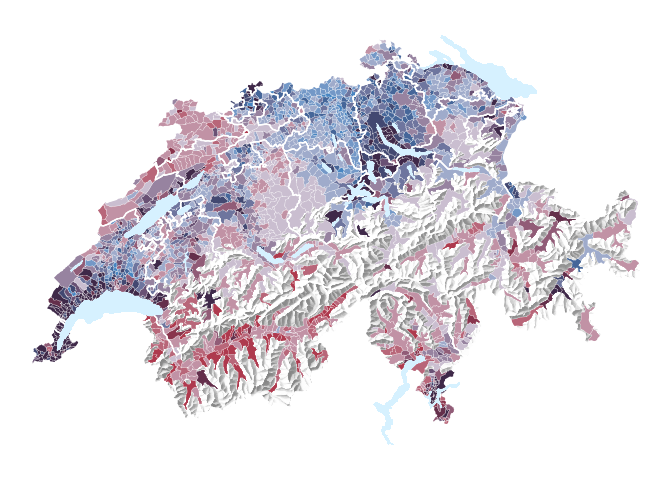

-   [Notes](#notes)
    -   [R-Script & data](#r-script-data)
    -   [GitHub](#github)
    -   [License](#license)
    -   [Data description of output
        files](#data-description-of-output-files)
    -   [`xyz.csv`](#xyz.csv)
-   [Preparations](#preparations)
    -   [Define packages](#define-packages)
    -   [Install packages](#install-packages)
    -   [Load packages](#load-packages)
-   [Read data](#read-data)
-   [Read Geodata](#read-geodata)
-   [Join Geodata with data](#join-geodata-with-data)
    -   [Create the bivariate color
        scale](#create-the-bivariate-color-scale)
    -   [Join color codes into geodata](#join-color-codes-into-geodata)
    -   [Draw bivariate thematic map](#draw-bivariate-thematic-map)
-   [Linting](#linting)

Notes {#notes}
-----

This report was generated on 2019-04-18 11:29:10. R version: 3.5.2 on
x86\_64-pc-linux-gnu. For this report, CRAN packages as of 2019-03-01
were used.

...

### R-Script & data {#r-script-data}

The preprocessing and analysis of the data was conducted in the [R
project for statistical computing](https://www.r-project.org/). The
RMarkdown script used to generate this document and all the resulting
data can be downloaded [under this
link](http://grssnbchr.github.io/bivariate-maps-ggplot2-sf/rscript.zip).
Through executing `main.Rmd`, the herein described process can be
reproduced and this document can be generated. In the course of this,
data from the folder `ìnput` will be processed and results will be
written to `output`.

### GitHub {#github}

The code for the herein described process can also be freely downloaded
from <https://github.com/grssnbchr/bivariate-maps-ggplot2-sf>.

### License {#license}

...

### Data description of output files {#data-description-of-output-files}

#### `abc.csv` (Example) {#abc.csv-example}

| Attribute | Type    | Description |
|-----------|---------|-------------|
| a         | Numeric | ...         |
| b         | Numeric | ...         |
| c         | Numeric | ...         |

### `xyz.csv` {#xyz.csv}

...

Preparations {#preparations}
------------

    ## [1] "package package:rmarkdown detached"

    ## Loading required package: knitr

    ## Loading required package: rstudioapi

### Define packages {#define-packages}

``` r
# from https://mran.revolutionanalytics.com/web/packages/checkpoint/vignettes/using-checkpoint-with-knitr.html
# if you don't need a package, remove it from here (commenting is probably not sufficient)
# tidyverse: see https://blog.rstudio.org/2016/09/15/tidyverse-1-0-0/
cat("
library(rstudioapi)
library(tidyverse) # ggplot2, dplyr, tidyr, readr, purrr, tibble
library(magrittr) # pipes
library(lintr) # code linting
library(sf) # spatial data handling
library(raster) # raster handling (needed for relief)
library(rmarkdown)",
file = "manifest.R")
```

### Install packages {#install-packages}

``` r
# if checkpoint is not yet installed, install it (for people using this
# system for the first time)
if (!require(checkpoint)) {
  if (!require(devtools)) {
    install.packages("devtools", repos = "http://cran.us.r-project.org")
    require(devtools)
  }
  devtools::install_github("RevolutionAnalytics/checkpoint",
                           ref = "v0.3.2", # could be adapted later,
                           # as of now (beginning of July 2017
                           # this is the current release on CRAN)
                           repos = "http://cran.us.r-project.org")
  require(checkpoint)
}
```

    ##   
       checking for file ‘/tmp/RtmpD1J4qL/remotes2b923d5729d8/RevolutionAnalytics-checkpoint-024b91d/DESCRIPTION’ ...
      
    ✔  checking for file ‘/tmp/RtmpD1J4qL/remotes2b923d5729d8/RevolutionAnalytics-checkpoint-024b91d/DESCRIPTION’
    ## 
      
    ─  preparing ‘checkpoint’:
    ## 
      
       checking DESCRIPTION meta-information ...
      
    ✔  checking DESCRIPTION meta-information
    ## 
      
    ─  checking for LF line-endings in source and make files and shell scripts
    ## 
      
    ─  checking for empty or unneeded directories
    ## 
      
    ─  building ‘checkpoint_0.4.0.tar.gz’
    ## 
      
       
    ## 

``` r
# nolint start
if (!dir.exists("~/.checkpoint")) {
  dir.create("~/.checkpoint")
}
# nolint end
# install packages for the specified CRAN snapshot date
checkpoint(snapshotDate = package_date,
           project = path_to_wd,
           verbose = T,
           scanForPackages = T,
           use.knitr = F,
           R.version = R_version)
rm(package_date)
```

### Load packages {#load-packages}

``` r
source("manifest.R")
unlink("manifest.R")
sessionInfo()
```

    ## R version 3.5.2 (2018-12-20)
    ## Platform: x86_64-pc-linux-gnu (64-bit)
    ## Running under: Ubuntu 18.04.1 LTS
    ## 
    ## Matrix products: default
    ## BLAS: /usr/lib/x86_64-linux-gnu/openblas/libblas.so.3
    ## LAPACK: /usr/lib/x86_64-linux-gnu/libopenblasp-r0.2.20.so
    ## 
    ## locale:
    ##  [1] LC_CTYPE=en_US.UTF-8       LC_NUMERIC=C              
    ##  [3] LC_TIME=de_CH.UTF-8        LC_COLLATE=en_US.UTF-8    
    ##  [5] LC_MONETARY=de_CH.UTF-8    LC_MESSAGES=en_US.UTF-8   
    ##  [7] LC_PAPER=de_CH.UTF-8       LC_NAME=C                 
    ##  [9] LC_ADDRESS=C               LC_TELEPHONE=C            
    ## [11] LC_MEASUREMENT=de_CH.UTF-8 LC_IDENTIFICATION=C       
    ## 
    ## attached base packages:
    ## [1] stats     graphics  grDevices utils     datasets  methods   base     
    ## 
    ## other attached packages:
    ##  [1] rmarkdown_1.11   raster_2.8-19    sp_1.3-1         sf_0.7-3        
    ##  [5] lintr_1.0.3      magrittr_1.5     forcats_0.4.0    stringr_1.4.0   
    ##  [9] dplyr_0.8.0.1    purrr_0.3.0      readr_1.3.1      tidyr_0.8.2     
    ## [13] tibble_2.0.1     ggplot2_3.1.0    tidyverse_1.2.1  checkpoint_0.4.0
    ## [17] usethis_1.5.0    devtools_2.0.2   rstudioapi_0.9.0 knitr_1.21      
    ## 
    ## loaded via a namespace (and not attached):
    ##  [1] httr_1.4.0        pkgload_1.0.2     jsonlite_1.6     
    ##  [4] modelr_0.1.4      assertthat_0.2.0  cellranger_1.1.0 
    ##  [7] yaml_2.2.0        remotes_2.0.4     sessioninfo_1.1.1
    ## [10] pillar_1.3.1      backports_1.1.3   lattice_0.20-38  
    ## [13] glue_1.3.0        digest_0.6.18     rvest_0.3.2      
    ## [16] colorspace_1.4-0  htmltools_0.3.6   plyr_1.8.4       
    ## [19] pkgconfig_2.0.2   broom_0.5.1       haven_2.1.0      
    ## [22] scales_1.0.0      processx_3.2.1    generics_0.0.2   
    ## [25] withr_2.1.2       lazyeval_0.2.1    cli_1.0.1        
    ## [28] crayon_1.3.4      readxl_1.3.0      memoise_1.1.0    
    ## [31] evaluate_0.13     ps_1.3.0          fs_1.2.6         
    ## [34] nlme_3.1-137      xml2_1.2.0        class_7.3-15     
    ## [37] pkgbuild_1.0.3    tools_3.5.2       prettyunits_1.0.2
    ## [40] hms_0.4.2         munsell_0.5.0     callr_3.1.1      
    ## [43] rex_1.1.2         compiler_3.5.2    e1071_1.7-0.1    
    ## [46] rlang_0.3.1       classInt_0.3-1    units_0.6-2      
    ## [49] grid_3.5.2        testthat_2.0.1    gtable_0.2.0     
    ## [52] codetools_0.2-16  DBI_1.0.0         curl_3.3         
    ## [55] R6_2.4.0          lubridate_1.7.4   rprojroot_1.3-2  
    ## [58] desc_1.2.0        stringi_1.3.1     Rcpp_1.0.0       
    ## [61] tidyselect_0.2.5  xfun_0.5

Read data {#read-data}
---------

``` r
data <- read_csv("input/data.csv")
```

Read Geodata {#read-geodata}
------------

``` r
# read municipality borders from 2015 (2324 municipalities)
municipality_geo <- read_sf("input/g2g15.shp")

# read cantonal borders
canton_geo <- read_sf("input/g2k15.shp")

# read country borders
country_geo <- read_sf("input/g2l15.shp")

# read lakes
lake_geo <- read_sf("input/g2s15.shp")

# read productive area
productive_area <- read_sf("input/productive_areas.shp")

# read in raster of relief (hillshading)
relief <- raster("input/02-relief-ascii.asc") %>%
  # hide hillshading outside of Switzerland by masking with country borders
  mask(country_geo) %>%
  as("SpatialPixelsDataFrame") %>%
  as.data.frame() %>%
  rename(value = layer)
```

    ## Warning in .rasterFromASCIIFile(x, ...): "NODATA_VALUE" not detected. Setting it to -Inf
    ##   You can set it to another value with function "NAvalue"

    ## Warning in is.na(mask) & !is.na(x): longer object length is not a multiple
    ## of shorter object length

``` r
# clean up
rm(country_geo)
```

Join Geodata with data {#join-geodata-with-data}
----------------------

``` r
# join into spatial data frame
municipality_geo %<>%
  left_join(data, by = c("GMDNR" = "bfs_id"))

# make new shape by intersecting municipality geodata with productive areas
# this is needed so the hillshading is visible on unproductive areas
municipality_prod_geo <-
  st_intersection(
    municipality_geo,
    productive_area
  )
```

    ## Warning: attribute variables are assumed to be spatially constant
    ## throughout all geometries

``` r
# clean up
rm(municipality_geo)
```

``` r
theme_clean <- function(...) {
  theme_void() +
  theme(
    axis.line = element_blank(),
    axis.text.x = element_blank(),
    axis.text.y = element_blank(),
    axis.ticks = element_blank(),
    axis.title.x = element_blank(),
    axis.title.y = element_blank(),
    panel.grid.minor = element_blank(),
    # due to a bug in ggplot the panel grid major in combination
    # with geom_sf does not work with element blank
    # read more: https://github.com/tidyverse/ggplot2/issues/2071
    panel.grid.major = element_line(colour = "transparent"),
    panel.background = element_blank(),
    plot.background = element_blank(),
    plot.margin = grid::unit(c(0, 0, 0, 0), "mm")
  )
}
```

First, let's create a standard (univariate) thematic map based on the
gini alone.

``` r
ggplot(
  municipality_prod_geo,
  aes(fill = gini)
) +
  # first: draw the relief
  geom_raster(
    data = relief,
    inherit.aes = FALSE,
    aes(
      x = x,
      y = y,
      alpha = value
    )
  ) +
  # use the "alpha hack"
  scale_alpha(name = "", range = c(0.6, 0), guide = F)  +
  # use thin white stroke for municipalities
  geom_sf(
    color = "white",
    size = 0.1
  ) +
  # use thicker white stroke for cantons
  geom_sf(
    data = canton_geo,
    inherit.aes = FALSE,
    fill = "transparent",
    color = "white",
    size = 0.5
  ) +
  # draw lakes in light blue
  geom_sf(
    data = lake_geo,
    inherit.aes = FALSE,
    fill = "#D6F1FF",
    color = "transparent"
  ) +
  theme_clean()
```


### Create the bivariate color scale {#create-the-bivariate-color-scale}

[Joshua
Stevens](http://www.joshuastevens.net/cartography/make-a-bivariate-choropleth-map/)
describes very well how to create the color codes for a sequential
bivariate color schemes. Using Sketch we combined four rectangles with
fill blue (\#1E8CE3) and red (\#C91024) each with four different
opacities (20%, 40%, 60%, 80%) and blend mode multiply. Which resulted
in the hex codes you see below.

``` r
# create 4 buckets for gini
quantiles_gini <- quantile(
  data$gini,
  probs = seq(0, 1, length.out = 5)
)

knitr::kable(
  quantiles_gini
)
```

|      |      x|
|------|------:|
| 0%   |  0.264|
| 25%  |  0.390|
| 50%  |  0.415|
| 75%  |  0.453|
| 100% |  0.936|

``` r
# create 4 buckets for mean income
quantiles_mean <- quantile(
  data$mean,
  probs = seq(0, 1, length.out = 5)
)

knitr::kable(
  quantiles_mean
)
```

|      |          x|
|------|----------:|
| 0%   |   16603.00|
| 25%  |   33733.00|
| 50%  |   38242.50|
| 75%  |   43068.25|
| 100% |  478065.00|

``` r
# based on the values above, we manually define the breaks in a more human
# readable way by rounding
pretty_breaks_gini <- c(0, 0.4, 0.45, 0.5, 1)
pretty_breaks_mean <- c(0, 35000, 40000, 45000, 1000000)

# create color scale that encodes two variables
# red for gini and blue for mean income
bivariate_color_scale <- tibble(
  "4 - 4" = "#3F2949",
  "4 - 3" = "#642F4B",
  "4 - 2" = "#89344C",
  "4 - 1" = "#AE3A4E",
  "3 - 4" = "#424871",
  "3 - 3" = "#695174",
  "3 - 2" = "#915C77",
  "3 - 1" = "#B86679",
  "2 - 4" = "#456699",
  "2 - 3" = "#6E759E",
  "2 - 2" = "#9783A0",
  "2 - 1" = "#C192A5",
  "1 - 4" = "#4885C1",
  "1 - 3" = "#7398C7",
  "1 - 2" = "#9FABCB",
  "1 - 1" = "#CABED0"
) %>%
  gather("group", "fill")
```

### Join color codes into geodata {#join-color-codes-into-geodata}

``` r
# cut into groups defined above and join fill
municipality_prod_geo %<>%
  mutate(
    gini_quantiles = cut(
      gini,
      # you can also use the quantiles with unrounded values: quantiles_gini
      breaks = pretty_breaks_gini,
      include.lowest = TRUE
    ),
    mean_quantiles = cut(
      mean,
      # you can also use the quantiles with unrounded values: quantiles_mean
      breaks = pretty_breaks_mean,
      include.lowest = TRUE
    ),
    # by pasting the factores together as numbers we match the groups defined
    # in the tibble bivariate_color_scale
    group = paste(
      as.numeric(gini_quantiles), "-",
      as.numeric(mean_quantiles)
    )
  ) %>%
  left_join(bivariate_color_scale, by = "group")
```

### Draw bivariate thematic map {#draw-bivariate-thematic-map}

``` r
ggplot(
  municipality_prod_geo,
  aes(
    fill = fill
  )
) +
  # first: draw the relief
  geom_raster(
    data = relief,
    inherit.aes = FALSE,
    aes(
      x = x,
      y = y,
      alpha = value
    )
  ) +
  # use the "alpha hack"
  scale_alpha(name = "", range = c(0.6, 0), guide = F)  +
  # use thin white stroke for municipalities
  geom_sf(
    color = "white",
    size = 0.1
  ) +
  # as the sf object municipality_prod_geo has a colum with name fill that
  # contains the hex code for each municipality, we can use scale_fill_identity
  scale_fill_identity() +
  # use thicker white stroke for cantons
  geom_sf(
    data = canton_geo,
    inherit.aes = FALSE,
    fill = "transparent",
    color = "white",
    size = 0.5
  ) +
  # draw lakes in light blue
  geom_sf(
    data = lake_geo,
    inherit.aes = FALSE,
    fill = "#D6F1FF",
    color = "transparent"
  ) +
  theme_clean()
```



Linting {#linting}
-------

The code in this RMarkdown is listed with the [lintr
package](https://github.com/jimhester/lintr), which is based on the
[tidyverse style guide](http://style.tidyverse.org/).

``` r
lintr::lint("index.Rmd")
```
